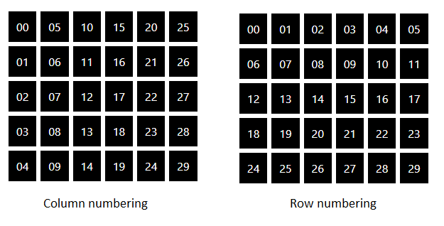
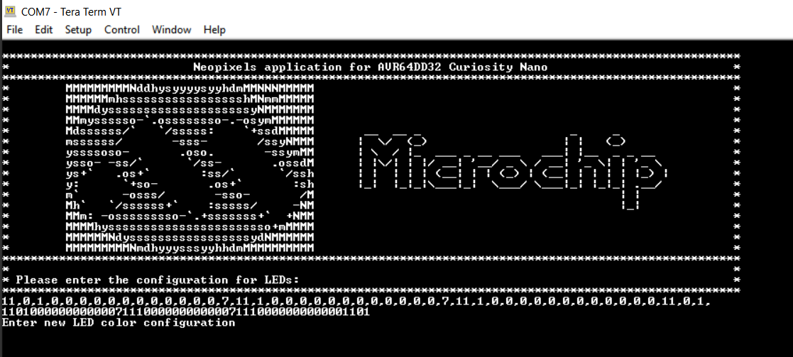

# Getting Started with Neopixels using the AVR64DD32 Microcontroller using MCC Melody

This repository provides an MPLAB® X project with an MPLAB® Code Configurator (MCC) generated code example for interfacing the CCL and SPI peripherals with Neopixel (WS2812) LEDs.

Furthermore, there is a web interface called **Creator UI** used to choose the color for each Neopixel. This interface can be used to define the size of an LEDs matrix. Such LEDs are connected sequentially but are mounted in the shape of a matrix (or other shape), therefore it is important to know the order in which they are connected.

## Related Documentation

More details and code examples on the AVR64DD32 can be found at the following links:

- [AVR64DD32 Product Page](https://www.microchip.com/wwwproducts/en/AVR64DD32)
- [AVR64DD32 Code Examples on GitHub](https://github.com/microchip-pic-avr-examples?q=AVR64DD32)
- [AVR64DD32 Project Examples in START](https://start.atmel.com/#examples/AVR64DD32CuriosityNano)
- [WS2812 Data Sheet](https://cdn-shop.adafruit.com/datasheets/WS2812.pdf)

## Software Used

- [MPLAB® X IDE](http://www.microchip.com/mplab/mplab-x-ide) v6.10 or newer
- [MPLAB® XC8](http://www.microchip.com/mplab/compilers) v2.41 or newer
- [AVR-Dx Series Device Pack](https://packs.download.microchip.com/) v2.3.272 or newer
- [MPLAB® Code Configurator](https://www.microchip.com/en-us/tools-resources/configure/mplab-code-configurator) v5.3.7 or newer
- [MPLAB® Code Configurator Melody](https://www.microchip.com/en-us/tools-resources/configure/mplab-code-configurator/melody) v2.6.1 or newer
- [Node.js](https://nodejs.org/en) 16.13.2 or newer

## Hardware Used

- The AVR64DD32 Curiosity Nano Development board is used as a test platform
     

- Curiosity Nano Adapter
     

- MikroElektronika 4x4 RGB LED Matrix Display mikroBus Click board
     

## Operation

To program the Curiosity Nano board with this MPLAB® X project, follow the steps provided in the [How to Program the Curiosity Nano Board](#how-to-program-the-curiosity-nano-board) chapter.  

## Creator UI

### Prerequisites

- Install Node.js 16.12.2 or newer
- From the *creator-ui* directory, open the terminal and run the following commands:
  - `npm install -g yarn`
  - `npm install react-scripts --save`
  - `yarn start`

### LED Numbering

Creator UI supports three numbering strategies: *row*, *column* and *manual*. *Row* and *column* numbering are described in the image below.

When *manual* numbering is selected, initially no numbers are assigned to the LEDs. Numbers are assigned by the user by clicking each LED in the order in which they are connected: First LED clicked first, second one clicked next, and so on. This way, complex numbering strategies can be achieved. In the image below, the LEDs are numbered in the shape of a spiral.

### Setting the LEDs Color

Once a numbered LED is clicked, its color can be set using a color picker that appears on the page. The Creator UI image above is descriptive for the Creator UI's functionality.

### Use the Generated Code

When all LEDs are configured, the last step is to click the **Code** button. This is used to create a string that can be used to configure the LEDs on board. After clicking this button, the code can be send through UART interface and the LEDs will be set to the configuration generated by this web interface.

[Back to Top](#getting-started-with-neopixels-using-the-avr64dd32-microcontroller-using-mcc-melody) 

## Setup

The board is connected as presented in the following diagram:

 

*Note*: The yellow wire is used to connect the output of LUT1 (PC3) to the input of RGB LED Matrix. The connection is: CS3 - RST1.

The following configurations must be made for this project:

System clock: 24 MHz

SPI0:

- Enable: True
- Mode: Host
- SPI Mode: 1
- Clock Frequency: 750 kHz

LUT1:

- Enable: True
- Enable Output: True
- Input 0: TCA0 (WO0)
- Input 1: SPI0 (MOSI)
- Input 2: TCA0 (WO2)
- Gate Type: Custom
- Output Result: 0xE0

TCA0:

- Mode: Single-Slope PWM
- Period: 100μs
- Enable Channel 0: True
- Enable Channel 2: True
- Channel 0 Duty cycle: 0.4%
- Channel 2 duty cycle: 0.7%
- Enable Count on Event Input B: True
- Event Action B: Restart on Positive Event Edge

EVSYS:

- Generators: SPI0_SCK -> CHANNEL0
- Users: CHANNEL0 -> TCA0CNTB

UART:

- UART PLIB Selector: USART0
- Requested Baudarate: 115200
- UART PLIB Selector: EUSART2
- Redirect `printf` to UART: Enabled
- Interrupt Driven: Enabled

|Pin               | Configuration      |
| :--------------: | :----------------: |
|PC0 (TCA0 WO0)    | Digital Output     |
|PC2 (TCA0 WO2)    | Digital Output     |
|PC3 (LUT1 OUT)    | Digital Output     |
|PA4 (SPI0 MOSI)   | Digital Output     |
|PA6 (SPI0 SCK)    | Digital Output     |
|PA7 (SPI0 SS)     | Digital Output     |
|PD4 (USART0 TX)   | Digital Output     |
|PD5 (USART0 RX)   | Digital Input      |

 **Note:** Only PC3 (LUT1 OUT) will be used to transmit data to the LED Matrix. The rest of the pins are routed outside for visualization of intermediary signals and for serial communication.

[Back to Top](#getting-started-with-neopixels-using-the-avr64dd32-microcontroller-using-mcc-melody) 

## Demo

- The configuration of the Creator UI is presented in the following picture:
   

- When all the LEDs are configured, the **Code** button can be used to generate the string that contains the LEDs configuration as presented below:
   

 - There is a message that will appear in the terminal. After that, the string that was generated by CreatorUI can be send to device via UART interface.
   

**Note**: The string needs to be followed by **Enter**.

- The result of this configuration is presented in the following picture:
   

[Back to Top](#getting-started-with-neopixels-using-the-avr64dd32-microcontroller-using-mcc-melody) 

## Summary

Using the peripherals on the AVR DD efficiently, Neopixels can be very easily controlled in software. Moreover, the Creator UI provides an easy way to generate a configuration of the LEDs colors.

[Back to Top](#getting-started-with-neopixels-using-the-avr64dd32-microcontroller-using-mcc-melody) 

## How to Program the Curiosity Nano Board

This chapter shows how to use the MPLAB® X IDE to program an AVR® device with an Example_Project.X. This can be applied to any other projects.

1. Connect the board to the PC.

2. Open the *avr64dd32-cnano-neopixels-mplab-mcc.X* project in MPLAB® X IDE.

3. Set the **avr64dd32-cnano-neopixels-mplab-mcc** project as main project. Right click on the project in the **Projects** tab and click **Set as Main Project**.

     

4. Clean and build the **avr64dd32-cnano-neopixels-mplab-mcc** project. Right click on the **avr64dd32-cnano-neopixels-mplab-mcc** project and select **Clean and Build**.

     

5. Select the **AVR128DA48 Curiosity Nano** in the Connected Hardware Tool section of the project settings:

    - Right click on the project and click **Properties**;
    - Click on the arrow under the Connected Hardware Tool;
    - Select the **AVR128DA48 Curiosity Nano** (click on the **SN**), click **Apply** and then click **OK**:

     

6. Program the project to the board. Right click on the project and click **Make and Program Device**.

     

 

- [Back to Creator-UI](#creator-ui)
- [Back to Setup](#setup)
- [Back to Demo](#demo)
- [Back to Summary](#summary)
- [Back to Top](#getting-started-with-neopixels-using-the-avr64dd32-microcontroller-using-mcc-melody) 
