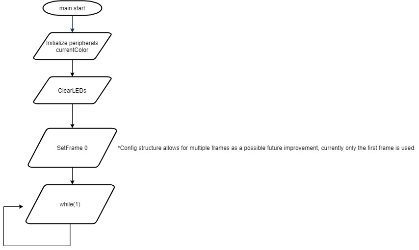
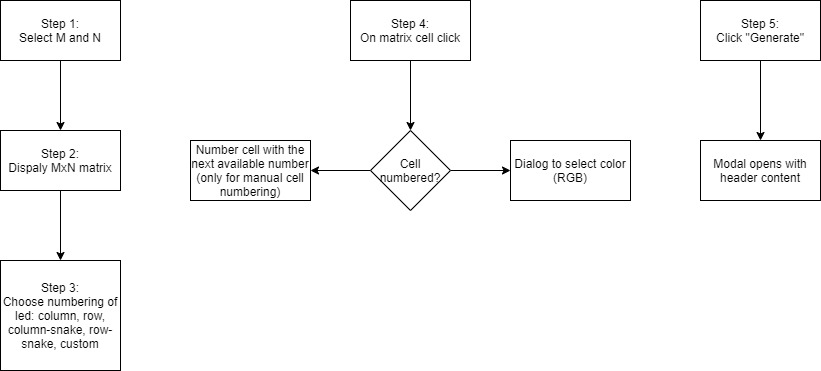

<br><br>
# <center> Neopixel configuration generator </center>
<br><br>
## <center> Design Specification </center>


## Revision History

| Revision Number | Revision Date | Changes                                                              | Author            |
|:---------------:|:-------------:|:---------------------------------------------------------------------|:---------:        |
|        1        |  27-oct-2020  | Added content.                                                       | Iustinian Bujor   |
|        2        |  23-nov-2020  | Updated color game.                                                  | Grig Barbulescu   |
|        3        |  09-dec-2020  | Described the Creator UI                                             | Alexandru Niculae |
|        .        |       .       |                                                                      |     .             |
|        .        |       .       |                                                                      |     .             |


## 1. Project Repository Name

- Repository name: avr64dd32-cnano-neopixels-mplab-mcc

## 2. Project Summary and Requirements

This code example interfaces the SPI peripheral of the AVRDD microcontroller with the WS2812 LED. The messages compatible with the WS2812 LED are formed from ones and zeros with a specific duration and form. The application translates the messages sent by SPI (through MOSI channel) into messages intelligible by WS2812. 

<br>The WS2812 protocol has the following form:
- a `0` is represented by a pulse with high side duration (T0H) of 350ns ± 150ns and low side duration (T0L) of 800ns ± 150ns;
- a `1` is represented by a pulse with high side duration (T1H) of 700ns ± 150ns and low side duration (T1L) of 600ns ± 150ns;
- reset signal: the line should be low for at least 50us.

The colors sent to each LED are read form a configuration structure that is generated using the Creator UI.

The "Creator UI" compenent is used to specify the number of LEDs and their configuration. Also, in the interface the color of each LED si chosen. From the UI a header file is generated and used to compile the microcontroller code. That header file contains the configurations of the LEDs strip.

<br>The peripherals used will be:
- Serial Peripheral Interface (SPI)
- Configurable Custom Logic (CCL)
- Timer/Counter Type A (TCA)
- Event System (EVSYS)

### 2.1. Project Requirements

#### 2.1.1. Prerequisites for development

##### Hardware
-	WS2812 LED Strip
-	Logic analyzer
-	AVR128DA48 CNANO >= A6 silicon (DM164151)
-   12V Charger/Voltage Source for the LEDs

##### Software
-	MPLAB X IDE v5.40
-	XC8 v2.31
-	MCC v4.0.1
-	AVR-Dx_DFP 1.6.88
-	8-bit AVR MCUs Lib version 2.5.0
-	Operating Systems (Windows, MacOS, Linux)
-	Logic analyzer tool (Saleae)

If the Creator UI is to be run locally the following software is also needed:
- Node.js
- npm

## 3. Software Specification

### 3.1. Description
This code example interfaces the SPI peripheral of the AVR128DA48 microcontroller with the WS2812 LED. The messages compatible with the WS2812 LED are formed from ones and zeros with a specific duration and form. The application translates the messages sent by SPI (through MOSI channel) into messages intelligible by WS2812. 


The strip band that will be use permits the control of the LEDs in groups of three. The number of the LED groups will be configured in software (`NUMBER_OF_LEDS` define macro). The code initializes the peripherals and starts sending the signal (through the SPI peripheral). 

#### 3.1.1. Parameters
- High side for `0` (T0H) should be 350ns ± 150ns
- Low side for `0` (T0L) should be 800ns ± 150ns
- High side for `1` (T1H) should be 700ns ± 150ns
- Low side for `1` (T1L) should be 600ns ± 150ns
- Each led should be lit for 100ms ± 5%

#### 3.1.2. Hardware Configuration
- CPU speed is configured at 24Mhz
- SPI0 is configured in Master Mode with clock frequency at 750kHz
- TCA0 is configured in Single Slope mode with Channel 0 and Channel 2 enabled. Its period is 100us and the duty cycles for the compare channels are: 0.4% and 0.7%.
- EVSYS ties together SPI and TCA0: SPI-CLK generates events and the TCA0 counter restarts at positive edge of event.
- LUT0 selects between TCA0-WO0 and TCA0-WO2 depending on the value of SPI0-MOSI.
- Pin Mapping: TCA0-WO0 (PA0), TCA0-WO2 (PA2), LUT0_OUT (PA3), SPI-MOSI (PA4), SPI-CLK (PA6).

### 3.2. Main Application Flowchart

<br>

### 3.3. Creator Ui Flowchart

<br>

### 3.4. File Structure

```
avr-dd-neopixel-creator
    ├── README.md
    ├── creator-ui
    ├── avr-dd-neopixel-creator.X
    │   ├── Makefile
    │   ├── MyConfig.mc3
    │   ├── main.c
    │   ├── mcc_generated_files
    │   │   ├── config
    │   │   │   └── clock_config.h
    │   │   ├── device_config.c
    │   │   ├── include
    │   │   │   ├── ccl.h
    │   │   │   ├── ccp.h
    │   │   │   ├── cpuint.h
    │   │   │   ├── evsys.h
    │   │   │   ├── pin_manager.h
    │   │   │   ├── port.h
    │   │   │   ├── protected_io.h
    │   │   │   ├── rstctrl.h
    │   │   │   ├── spi0.h
    │   │   │   └── tca0.h
    │   │   ├── mcc.c
    │   │   ├── mcc.h
    │   │   ├── src
    │   │   │   ├── ccl.c
    │   │   │   ├── cpuint.c
    │   │   │   ├── evsys.c
    │   │   │   ├── pin_manager.c
    │   │   │   ├── protected_io.S
    │   │   │   ├── spi0.c
    │   │   │   └── tca0.c
    │   │   └── utils
    │   │       ├── assembler
    │   │       │   ├── gas.h
    │   │       │   └── iar.h
    │   │       ├── assembler.h
    │   │       ├── atomic.h
    │   │       ├── compiler.h
    │   │       ├── interrupt_avr8.h
    │   │       ├── utils.h
    │   │       └── utils_assert.h
    │   └── nbproject
    │       ├── configurations.xml
    │       └── project.xml
    ├── doc
    │   ├── design-spec.md
    │   ├── images
    │   │   ├── block-diagram.drawio
    │   │   ├── block-diagram.png
    │   │   ├── flow-diagram.drawio
    │   │   └── flow-diagram.png
    │   └── test-spec.md
    └── images
        ├── AVR128DA48_CNANO_instructions.PNG
        ├── Clean_and_Build.png
        ├── Demo.PNG
        ├── Demo.gif
        ├── Make_and_Program_Device.png
        ├── Microchip.png
        ├── Selection_Tool.png
        └── Set_as_Main_Project.png
``` 

### 3.5. Detailed Specification

#### 3.5.1.	Pre-existing APIs Used

##### MCC-generated APIs used by this project
- `SYSTEM_Initialize()`
- `SPI0_ExchangeByte()`

##### Compiler, library and DFP related APIs used by this project
- `_delay_ms()`

#### 3.5.2.	Custom Data and Data Types 

```
const color_t config_creator_ui[1][13] = {
	{
		{126, 211, 33},
		{255, 0, 0},
		{184, 233, 134},
		{74, 144, 226},
		{255, 255, 255},
		{144, 19, 254},
		{248, 231, 28},
		{208, 2, 27},
		{255, 255, 255},
		{0, 0, 0},
		{65, 117, 5},
		{208, 2, 27},
		{0, 44, 255},
	},
};
```
- Description: color table containing the sequence of information to be written into RGB LED stripe (in this example one sequence for a 13 LEDs/groups stripe)
<br><br>

```
typedef struct
{
    uint8_t redChannel;
    uint8_t greenChannel;
    uint8_t blueChannel;
} color_t;
```
- Description: used to define the three color channels
<br><br>

#### 3.5.3.	Custom Functions

##### `ClearLEDs`

- Prototype:
<br> `void ClearLEDs(void);`

- Description:
<br> used for initial clearing of the LEDs, or any other turn-off-all

- Parameters:
<br> none

- Return Value:
<br> None

- Example:
<br> `ClearLEDs();`

##### `SetFrame`

- Prototype:
<br> `static void SetFrame(const color_t* frame) `

- Description:
<br> Calls three times `SetLEDColor()` to send the color values for each LED in the strip, in the order they are defined, that matches the order they are connected.

- Parameters:
<br> `const color_t* frame` – array of LED color, of length equal to the number of LEDs

- Return Value:
<br> None

- Example:
<br>
```
SetFrame(config_creator_ui[0]);
```

##### `SetLEDColor`

- Prototype:
<br> `void SetLEDColor(color_t color);`

- Description:
<br> Calls three times `SPI0_ExchangeByte()` to send the color values in the following order:<br> `redChannel`, `blueChannel`, `greenChannel`.

- Parameters:
<br> `color_t color` – light intensity for all three channels

- Return Value:
<br> None

- Example:
<br>
```
SetLEDColor(currentColor);
```

##### `main`

- Prototype:
<br> `int main(void);`

- Description:
<br> Initializes the system, gets the color information from the table `colorTable[]` and loops the LED strip configurations.

- Parameters:
<br> none

- Return Value:
<br> `int` - unused but required to avoid the compiler warning


#### 3.5.4.	Custom Define Macros

##### `#define LED_MAX_BRIGHT   0xFF`
- Description: Maximum brightness of a color channel.

##### `#define LED_MIN_BRIGHT   0x00`
- Description: Minimum brightness of a color channel.

##### `#define DELAY_TIME   100`
- Description: Duration of the refresh signal expressed in millliseconds. Time duration in which an LED/group of LEDs is ON.

##### `#define NUMBER_OF_FRAMES   1`
- Description: Number of frames (set of colors, one for each LED/group). Currently allways 1, support for multiple frames was design as a future improvement opportuniy.

##### `#define NUMBER_OF_LEDS   13`
- Description: Number of LEDs/groups of LEDs contained by the strip.